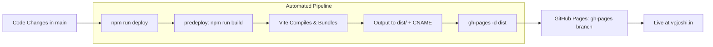

<div align="center">

# 🌐 Vishwash Joshi — Portfolio

**Personal Portfolio & Engineering Showcase of Vishwash Joshi**  
*AI Engineer & Full-Stack / DevOps Developer*

[](https://vpjoshi.in)
[](https://react.dev/)
[](https://vitejs.dev/)
[](https://tailwindcss.com/)
[](https://vpjoshi.in)

<br />

[Explore Live Demo](https://vpjoshi.in) • [View Projects](#-featured-projects) • [Tech Stack](#-tech-stack) • [CI/CD & Deployment](#-automated-deployment--cicd) • [Local Setup](#-getting-started)

</div>

---

## 📌 Overview

This repository hosts the source code for [vpjoshi.in](https://vpjoshi.in), the personal developer portfolio of **Vishwash Joshi**. Designed with an ultra-clean, cyberpunk-inspired dark aesthetic, high-performance responsive components, and fluid animations, it serves as a central hub highlighting production-ready AI systems, distributed architectures, self-hosted infrastructure, and cloud engineering projects.

### 🌟 Key Highlights

- **⚡ Lightning Fast Performance**: Powered by **Vite 7** and **React 19** with instant HMR and minimal production bundle sizes.
- **🎨 Modern Dark UI**: Built with **Tailwind CSS v4** utilizing smooth backdrop blur navigation, custom typography (*Centra*), subtle glow effects, and responsive grid layouts.
- **📱 Fully Responsive**: Flawlessly adapts to mobile devices, tablets, and ultra-wide desktop monitors.
- **🗂️ Categorized Project Portfolio**: Dynamic tabbed filtering across **Core Systems**, **DevOps**, **AIML**, and award-winning **Hackathon Projects** (with live demo links, documentation, source code, and video walkthroughs).
- **🎠 Interactive Skills Carousel**: Powered by `react-multi-carousel` showcasing specialized capabilities from low-level systems to modern AI/ML pipelines.
- **📬 Functional Contact System**: Client-validated contact form integrated with a self-hosted API backend (`selfhosted-api.vpjoshi.in`) featuring DDoS and spam rate-limiting protection.
- **🔄 Streamlined One-Command CI/CD**: Fully automated build and deployment to GitHub Pages and custom domain `vpjoshi.in` via `npm run deploy`.

---

## 🛠️ Tech Stack

| Domain | Technologies |
| :--- | :--- |
| **Frontend Framework** | [React 19](https://react.dev/) |
| **Bundler & Tooling** | [Vite 7](https://vitejs.dev/) (ESModules) |
| **Styling & Design** | [Tailwind CSS v4](https://tailwindcss.com/) (`@tailwindcss/vite`), Custom CSS Keyframe Animations |
| **Icons & Media** | [React Bootstrap Icons](https://icons.getbootstrap.com/), SVG vector graphics |
| **Interactive Components** | [React Multi Carousel](https://www.npmjs.com/package/react-multi-carousel) |
| **Code Quality** | ESLint 9 |
| **Deployment & Hosting** | [GitHub Pages](https://pages.github.com/) with custom apex domain DNS configuration (`vpjoshi.in`) |

---

## 🚀 Featured Projects Showcased

The portfolio categorizes projects across domains, reflecting deep practical experience:

### 1. 🖥️ Core & Distributed Systems
- **[Joshi OTT](https://ott.vpjoshi.in)**: Netflix-style media platform featuring adaptive HLS video streaming, AWS Lambda serverless authentication, and Amazon DynamoDB deployed on EC2. [[Docs](https://docs.vpjoshi.in/#/ott) • [Code](https://github.com/Joshi-labs/joshiott_latest/tree/main)]
- **[Orbit Container Orchestrator](https://docs.vpjoshi.in/#/orbit)**: Lightweight distributed container orchestrator written in Go from scratch to schedule and run Docker workloads across clusters without Kubernetes overhead. [[Code](https://github.com/Joshi-labs/orbit)]
- **[SyncDocs](https://sync-docs.vpjoshi.in)**: High-scale real-time collaborative document editor built on AWS. [[Docs](https://docs.vpjoshi.in/#/sync-docs) • [Code](https://github.com/Joshi-labs/SyncDocs_Main_frontend)]
- **[S3 Drive](https://s3-drive.vpjoshi.in)**: Self-hosted Google Drive alternative leveraging AWS S3 object storage with a Go backend. [[Docs](https://docs.vpjoshi.in/#/s3-drive) • [Code](https://github.com/Joshi-labs/s3-drive)]
- **[Custom Automotive OS](https://docs.vpjoshi.in/#/os)**: Custom Linux operating system built on Arch Linux with a React-powered GUI designed for electric vehicles.

### 2. ⚙️ DevOps & Cloud Infrastructure
- **[Self-Hosted Server / Homelab](https://stats.vpjoshi.in)**: Bare-metal `k3s` cluster running local LLaMA 3.2 models, n8n workflows, PostgreSQL, and Grafana — cutting cloud costs by ₹10,000/month. [[Docs](https://docs.vpjoshi.in/#/server)]
- **[Monitoring Stack](https://grafana.vpjoshi.in)**: Full-stack Grafana + Prometheus observability system capturing live metrics for CPU, memory, power draw, and bandwidth. [[Docs](https://docs.vpjoshi.in/#/monitoring)]
- **[GitHub Actions CI/CD](https://github.com/Joshi-labs/stats/blob/master/.github/workflows/deploy.yml)**: Continuous deployment pipeline targeting self-hosted `k3s`, publishing container images to GHCR and performing rolling zero-downtime updates.
- **[Cloudflare Tunnels](https://docs.vpjoshi.in/#/cloudflare)**: Zero-Trust ingress securing 12+ self-hosted services across 3 domains without opening incoming firewall ports, with automated TLS and ~350ms response times.
- **AWS Production Deployments**: Production architectures spanning Amazon EKS, Lambda, MSK, SES, CloudFront, Route 53, and EC2.

### 3. 🧠 AI / ML Engineering & Hackathons
- **[VPC Threat Lens (SOC RAG)](https://threat-lens.vpjoshi.in/)**: AI-powered SOC investigation and log threat intelligence platform utilizing Retrieval-Augmented Generation (RAG). [[Docs](https://docs.vpjoshi.in/#/vpc_threat_lens) • [Code](https://github.com/Joshi-labs/VPCThreatLens)]
- **[Dark Web Surveillance Tool](https://docs.vpjoshi.in/#/hackathon2)**: Zero-cost AI surveillance tool detecting illicit network activities. [[Video Demo](https://www.youtube.com/watch?v=NUIAEJaAVQI)]
- **[AI Ticketing System](https://docs.vpjoshi.in/#/hackathon1)**: Cost-effective customer ticketing system utilizing multilingual AI analysis and classification. [[Video Demo](https://www.youtube.com/watch?v=2zsQ9blK_zA)]
- **[Legal AI Assistant](https://docs.vpjoshi.in/#/hackathon3)**: Fine-tuned legal assistance LLM built for the Department of Justice at Smart India Hackathon (SIH) 2024. [[Video Demo](https://www.youtube.com/watch?v=UXvvrmIAqxc)]

---

## 🔄 Automated Deployment & CI/CD

Deploying changes to [vpjoshi.in](https://vpjoshi.in) is executed via a streamlined, automated npm lifecycle pipeline configured in `package.json`:



### How It Works

1. **Predeploy Hook**:
   Running `npm run deploy` automatically triggers the `"predeploy"` script:
   ```json
   "predeploy": "npm run build",
   "deploy": "gh-pages -d dist"
   ```
2. **Production Compilation**:
   Vite processes the JSX, compiles modern Tailwind CSS styles, resolves static assets, copies the `public/CNAME` file (`vpjoshi.in`), and packages everything into an optimized `dist/` directory.
3. **Automated Publishing**:
   The `gh-pages` utility commits the contents of `dist/` directly into the `gh-pages` branch on GitHub, updating the live site within seconds with zero manual configuration.

---

## 📁 Project Structure

```text
portfolio/
├── public/                       # Static public assets served directly
│   ├── CNAME                     # Custom domain binding (vpjoshi.in)
│   ├── icon_white.ico            # Site favicon
│   ├── resume.pdf                # Downloadable resume
│   └── robots.txt                # Search engine crawler instructions
├── src/
│   ├── assets/
│   │   ├── font/                 # Custom typefaces (Centra)
│   │   └── img/                  # Logos, project previews, certification badges
│   │       ├── certs/            # AWS SAA, DevOps, Python certifications
│   │       ├── comp/             # Experience logos (EPAM, Hartalkar)
│   │       ├── projects/         # Project preview imagery
│   │       └── skills/           # Skill category icons
│   ├── components/               # Modular UI components
│   │   ├── Banner.jsx            # Hero banner, bio, resume CTA & certifications
│   │   ├── Companies.jsx         # Industry experience & company affiliations
│   │   ├── Contact.jsx           # Validated contact form with self-hosted API
│   │   ├── Footer.jsx            # Footer navigation, contact info & quote
│   │   ├── NavBar.jsx            # Sticky blurred navigation bar & social links
│   │   ├── Projects.jsx          # Tabbed project showcase & hackathon grid
│   │   └── Skills.jsx            # Categorized skills list & infinite carousel
│   ├── App.jsx                   # Primary layout & component tree
│   ├── index.css                 # Tailwind v4 import, custom font & keyframes
│   └── main.jsx                  # React 19 root mount
├── index.html                    # Application HTML entry point
├── package.json                  # Dependencies, metadata & deploy scripts
├── vite.config.js                # Vite 7 configuration with Tailwind & React plugins
└── README.md                     # Project documentation
```

---

## 💻 Getting Started

### Prerequisites

Ensure you have [Node.js](https://nodejs.org/) (v18 or higher recommended) and `npm` installed on your machine.

### 1. Clone the Repository

```bash
git clone https://github.com/Joshi-labs/portfolio.git
cd portfolio
```

### 2. Install Dependencies

```bash
npm install
```

### 3. Start Local Development Server

```bash
npm run dev
```
Open your browser and navigate to `http://localhost:5173`.

### 4. Build for Production

To test the production build locally:

```bash
npm run build
npm run preview
```

### 5. Deploy to Production

To build and deploy updates directly to [vpjoshi.in](https://vpjoshi.in):

```bash
npm run deploy
```

---

## 📜 Certifications Featured

- 🏅 **AWS Certified Solutions Architect – Associate** ([Verify on Credly](https://www.credly.com/badges/5a4db644-385d-4e03-9669-4023102e2136/public_url))
- 🏅 **DevOps Professional Certificate** (PagerDuty & LinkedIn)
- 🏅 **Python Developer Certification**

---

## 📬 Contact & Connect

- **Website**: [vpjoshi.in](https://vpjoshi.in)
- **GitHub**: [@Joshi-labs](https://github.com/Joshi-labs)
- **LinkedIn**: [vishwash-joshi](https://www.linkedin.com/in/vishwash-joshi/)
- **LeetCode**: [vpjoshi](https://leetcode.com/u/vpjoshi/)
- **Email**: [vishwashmax@gmail.com](mailto:vishwashmax@gmail.com)

---

<div align="center">
  <sub>Designed & Developed by <b>Vishwash Joshi</b>. Stay Hungry — Stay Frosty.</sub>
</div>

